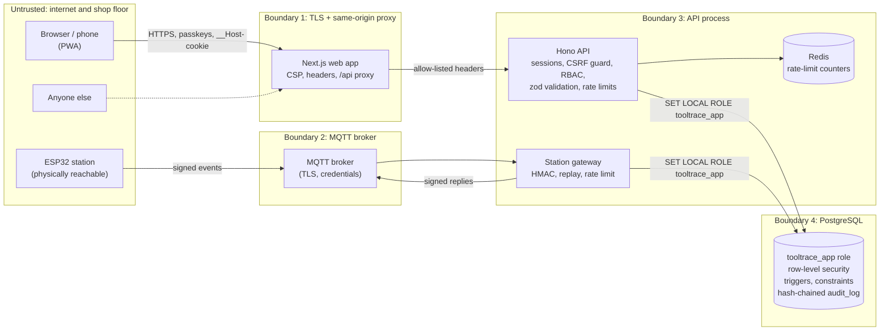

# ToolTrace threat model

This document uses **STRIDE** (Spoofing, Tampering, Repudiation, Information disclosure, Denial of service, Elevation of privilege) to walk through what could go wrong in ToolTrace, what stops it, and where the code and tests for each defense live. It ends with the risks that remain, stated plainly.

Last reviewed: Phase 4 (hardening).

## 1. What we protect

| Asset | Why it matters |
|---|---|
| **Check-out records** (who has which tool) | Lost-tool investigations and accountability depend on them |
| **Calibration records** | Using an out-of-calibration torque wrench can mean a failed aircraft or car part. Auditors (ISO 9001 / AS9100 / IATF 16949) inspect these |
| **The audit trail** | Evidence. Worthless if it can be edited |
| **Accounts and roles** | An attacker with Admin can do anything |
| **Station master key** | Every station key is derived from it |
| **Personal data** | Names, work emails, badge UIDs, sign-in IP addresses |

## 2. System and trust boundaries

**Boundary 4 is the important one.** Every request a signed-in person makes, and every station message, runs inside a database transaction that has switched to the least-privileged `tooltrace_app` role with the caller's identity attached (`tooltrace.role`, `tooltrace.user_id`, `tooltrace.station_id`). PostgreSQL itself then enforces who may see and change which rows. A bug in a route handler can't hand a technician someone else's data, because the database won't return it.

### Data flows

| # | Flow | Protection in transit | Authentication |
|---|---|---|---|
| F1 | Browser → web app | TLS (HSTS) | Passkey → session cookie |
| F2 | Web app → API | Private network or TLS | Cookie forwarded on an allow-list |
| F3 | Station → broker → API | MQTT over TLS | Broker credentials + per-message HMAC-SHA256 |
| F4 | API → station | MQTT over TLS | HMAC-signed reply bound to the station's last sequence number |
| F5 | API → PostgreSQL | TLS in production | Database credentials, then `SET LOCAL ROLE` |
| F6 | API → Redis | Private network or TLS | Redis URL credentials |
| F7 | PostgreSQL → API (NOTIFY) | Same connection | Only fires on commit |

## 3. STRIDE analysis

Each row names the defense, where it is implemented, and the test that proves it.

### S: Spoofing (pretending to be someone or something else)

| Threat | Defense | Code | Test |
|---|---|---|---|
| Stolen or phished password | No passwords exist. Passkeys are bound to the site origin, so a lookalike domain can't use them | `routes/auth.ts` | `auth.test.ts` (wrong origin, wrong RP ID rejected) |
| Captured sign-in replayed | Challenges are server-side, single-use (deleted on read), expire in 5 minutes | `consumeChallenge` in `routes/auth.ts` | `auth.test.ts` (replay rejected) |
| Strangers registering | Invite-only. Single-use invite tokens, stored only as SHA-256 hashes, claimed atomically | `services/invites.ts`, `register/verify` | `auth.test.ts`, e2e "same invite link cannot be used twice" |
| Stolen session cookie used elsewhere | `__Host-` cookie, `HttpOnly`, `Secure`, `SameSite=Strict`; only its hash is stored | `middleware/session.ts` | `auth.test.ts` (cookie flags) |
| Forged station message | HMAC-SHA256 with a per-station key derived by HKDF from a master key | `stations/crypto.ts`, `stations/gateway.ts` | `stations.test.ts` (forged, altered, wrong key), shared vectors in C++ |
| Fake reply shown on a station screen | Replies are signed and must answer the station's own last sequence | `firmware/station/src/station_core.h` | `test_core.cpp` |
| Station pretends to be another station | Key is derived from the station's id; RLS lets a station update only its own row | `003_hardening.sql` policies `stations_update`, `station_events_insert` | `security.test.ts` "a station can only touch its own row and log only its own events" |
| Technician records an action as someone else | RLS: a technician may only insert check-outs where holder = issuer = themselves | policy `checkouts_insert` | `security.test.ts` "a technician cannot pretend someone else issued the tool" |

### T: Tampering (changing data you shouldn't)

| Threat | Defense | Code | Test |
|---|---|---|---|
| SQL injection | All queries are parameterized tagged templates; no string-built SQL. CodeQL scans every push | postgres.js throughout | CodeQL `js/sql-injection` |
| Check-out of an out-of-calibration tool, or a tool issued twice | Enforced in the database: trigger + partial unique index, so even a bug or a direct insert can't break the rule | `001_init.sql` | `tools-checkouts.test.ts` (direct DB insert refused, concurrent check-outs) |
| Tool status drifting from reality | Status is maintained by a database trigger from check-outs and returns; the app role can't set `checked_out` itself | `sync_tool_status()` | `security.test.ts`, all floor tests |
| Technician edits tools or calibrations | Column-level `GRANT`s plus RLS write policies for admin/storekeeper only | `003_hardening.sql` | `security.test.ts` "a technician cannot edit or retire tools" |
| Half-finished writes after an error | Every API request runs in one transaction; any status ≥ 400 or exception rolls it back | `requestTransaction` in `middleware/db.ts` | `security.test.ts` "a failed request leaves no half-finished changes" |
| A read endpoint that secretly writes | GET requests run in a `READ ONLY` transaction | `requestTransaction` | `security.test.ts` (error 25006) |
| **Editing or deleting audit entries** | Triggers block `UPDATE`, `DELETE` and `TRUNCATE` on `audit_log` for everyone, including the owner. The app role has no write grant at all; entries are added only through `audit_append()` | `003_hardening.sql` | `security.test.ts` "cannot be changed or deleted, even by the database owner" |
| A superuser bypasses the triggers and edits history | Hash chain: each entry stores `sha256(prev_hash ‖ entry)`. `/api/audit/verify` recomputes the whole chain and reports the first edited, missing or relinked entry | `audit_append()`, `routes/audit.ts` | `security.test.ts` "spots an edited entry", "spots a deleted entry" |
| A superuser rewrites the **entire** chain consistently | **Anchors**: the verify screen shows `id:hash` of the head; saved outside ToolTrace, it later proves the chain still contains that exact entry | `routes/audit.ts`, `/audit` page | `security.test.ts` "spots a rewritten chain, given an anchor recorded earlier", e2e audit test |
| Gaps in the chain from concurrent writers | `audit_append()` takes a transaction-level advisory lock; ids are gapless and in commit order | `audit_append()` | `security.test.ts` "verifies as intact, with gapless ids, after many concurrent writes" |
| Malicious dependency or leaked secret in git | Dependabot, `npm audit` (high), gitleaks over full history, CodeQL, Grype image scan | `.github/workflows/*` | CI |

### R: Repudiation ("I never did that")

| Threat | Defense |
|---|---|
| Someone denies issuing, returning, recalibrating a tool, or changing a role | Every such change is written to the audit trail **by database triggers**, in the same transaction as the change, so there's no code path that changes data without logging it. Each entry has the actor (person and/or station), IP address, time and before/after values |
| Someone denies trying to sign in | Failed sign-ins are recorded with the reason (unknown passkey, deactivated, wrong user, bad signature). The client always gets the same generic error |
| A station claims it never sent a forged message | Rejected station messages (bad signature, replay, wrong clock, malformed, switched off) go to the audit trail too |
| The log itself is disputed | The hash chain plus external anchors make the log tamper-evident (see Tampering) |

### I: Information disclosure

| Threat | Defense | Test |
|---|---|---|
| Technician sees others' check-outs or people's emails | RLS: technicians see open check-outs (needed for the board) and their own history only. `/holders` returns no emails | `security.test.ts` "everyone sees what is out now, but past checkouts stay private", `access-control.test.ts` |
| Non-admins read invites, sessions or the audit trail | RLS + route roles | `security.test.ts` |
| App role reads passkeys, challenges or session token hashes | Not granted to `tooltrace_app` at all (column grants on `sessions`) | `security.test.ts` least-privilege tests |
| Database dump leaks credentials | Session and invite tokens stored only as SHA-256 hashes; no passwords exist; station keys never stored | `auth.test.ts` |
| XSS steals the session | `HttpOnly` cookie; React escapes output; CSP `frame-ancestors 'none'`, `object-src 'none'`, `connect-src 'self'` | e2e security headers test, ZAP |
| Error messages leak internals | One generic error envelope; unexpected errors are logged server-side and returned as a plain 500 | `lib/errors.ts` |
| Invite token in server logs | Token sits in the URL fragment, which browsers never send; it's wiped from the address bar once read | e2e invite test |
| Spectre-style side-channel reads by another site | Cross-origin isolation: `Cross-Origin-Opener-Policy`, `Cross-Origin-Resource-Policy` and `Cross-Origin-Embedder-Policy` on every page | e2e security headers test, ZAP rule 90004 |
| Shared tablet shows a previous user's data | Service worker never caches `/api`; `Cache-Control: no-store` | e2e |

### D: Denial of service

| Threat | Defense |
|---|---|
| Sign-in brute force or flooding | Per-IP limit on `/api/auth/*` (default 30/min) |
| A signed-in account (or stolen session) hammers the API | Per-user limit across all routes (default 300/min) |
| Limits reset by restarting or bypassed by hitting another replica | Counters in **Redis** (atomic Lua script), shared by all API instances |
| Redis outage takes the crib offline | The limiter **fails open** with a throttled warning (see residual risks) |
| A station floods MQTT | Per-station token bucket; excess messages are dropped and logged |
| Huge request bodies | 64 KB body limit; zod limits on every string and array |
| Many long-lived event streams | Streams need a valid session, re-checked every heartbeat |

### E: Elevation of privilege

| Threat | Defense | Test |
|---|---|---|
| Technician calls an admin route | Role check on every route **and** RLS in the database (defense in depth: both must fail for a breach) | `access-control.test.ts`, `security.test.ts` |
| Non-admin changes someone's role | RLS policy `users_update` requires `app_role() = 'admin'`; only `role`, `is_active` and `badge_uid` columns are even updatable | `security.test.ts` |
| Admin demotes themselves or races another admin | Self-change blocked; admin changes serialized and re-checked inside the transaction | `access-control.test.ts` concurrent demotions |
| Deactivated user keeps a session | Deactivation or role change deletes all their sessions immediately | e2e "signed out everywhere" |
| Code in the app role calls privileged functions | `audit_append()` is `SECURITY DEFINER` with `EXECUTE` revoked from `PUBLIC`; it's reachable only through triggers | `security.test.ts` (42501) |
| CSRF makes a signed-in user act | `SameSite=Strict` + Origin / `Sec-Fetch-Site` check on every state change | `auth.test.ts` |

## 4. Residual risks (what is *not* fully solved)

Being honest about these is part of the design.

1. **Unauthenticated routes run as the database owner.** Passkey sign-in, registration and session lookup happen before anyone is known, so they can't use RLS identity. They're small, parameterized, and covered by tests and CodeQL. A stronger setup would connect with a non-owner login role that can only `SET ROLE` into `tooltrace_app` and a narrow auth role.
2. **`SET LOCAL ROLE` can be undone by SQL running in the same transaction** (`RESET ROLE`). It protects against logic bugs, not against arbitrary SQL execution. Parameterized queries are what stop injection.
3. **Writes are serialized by one advisory lock** so the audit chain stays gapless. A tool crib does tens of writes per minute, so this is fine; a system with thousands of writes per second would need a different design (for example, per-partition chains or a batched Merkle log).
4. **Anchors only help if someone saves them.** Without an external anchor, an attacker with superuser access could rewrite the whole chain consistently. Automating this (e-mailing the daily anchor, or publishing it to an append-only external store) is planned.
5. **The rate limiter fails open.** If Redis is down, limits aren't enforced. This is a deliberate availability choice (the crib must keep working); passkeys mean brute force isn't a practical attack on sign-in anyway.
6. **RFID badge UIDs can be cloned.** The MFRC522 reads only the card UID, which cheap tools can copy. Mitigations: a badge only opens a 30-second window, every action is logged with the station and time, and switching off a badge is instant. A production deployment should use cards with cryptographic authentication (e.g. MIFARE DESFire EV3).
7. **Physical access to a station.** Someone with the device can read its key from flash. Enable ESP32 flash encryption and secure boot in production; rotate the key from the Stations page if a device is lost.
8. **Web CSP allows `'unsafe-inline'` scripts.** Next.js inlines its bootstrap scripts; nonces would force every page to render dynamically. React's output escaping is the main XSS defense; there is no user-supplied HTML anywhere.
9. **Public demo MQTT brokers.** The development broker is anonymous. Messages are still signed, so a stranger can't forge taps, but they can see tag UIDs. Production must use a broker with TLS and credentials.
10. **Lost passkey device.** An admin re-invites the person; there's no self-service recovery, by design.

## 5. How this is verified continuously

| Check | Where | Runs |
|---|---|---|
| 114 API integration tests (27 security-specific: RLS, privileges, audit chain tampering, rate limits on real Redis) | `apps/api/test` | Every push |
| 21 browser tests with real passkeys and axe accessibility scans, including the audit trail | `apps/web/e2e` | Every push |
| 58 firmware checks against shared signing vectors | `firmware/station/test/host` | Every push |
| CodeQL (`security-extended`) for TypeScript and the C++ station core | `security.yml` | Every push + weekly |
| gitleaks over the full git history | `security.yml` | Every push + weekly |
| OWASP ZAP baseline against the full Docker Compose stack | `security.yml` | Every push + weekly |
| Grype CVE scan of both container images | `ci.yml` | Every push |
| `npm audit`, Dependabot (npm, Actions, Docker) | `ci.yml`, `dependabot.yml` | Every push / weekly |
